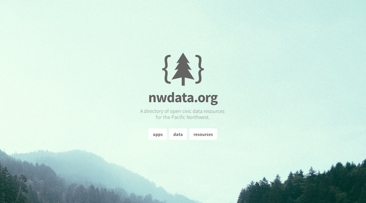

# [nwdata.org](http://nwdata.org)
> directory of civic data resources in the pacific northwest

### This project is new! Help build this directory of tools & resources!

### This project is open source!
Contribute to nwdata.org by forking this repository. If you're not about to fork the repository and just want to suggest a data source, app, or other resource, you can currently [make that suggestion via our issues queue on GitHub](https://github.com/sethvincent/nwdata.org/issues).
